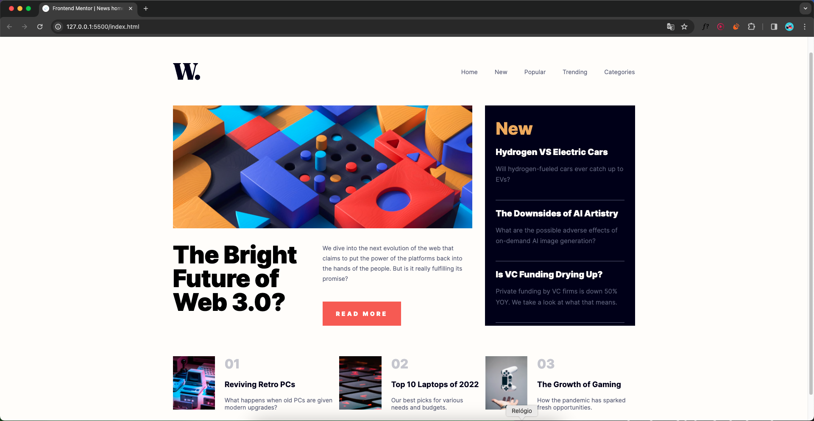

# Guia de Estilo Frond-End

## Layout

Os designs foram criados com as seguintes larguras:

- Mobile: 375px
- Desktop: 1440px

## Cores

### Primárias

- Soft orange: hsl(35, 77%, 62%)
- Soft red: hsl(5, 85%, 63%)

### Neutras

Off-white: hsl(36, 100%, 99%)
Grayish blue: hsl(233, 8%, 79%)
Dark grayish blue: hsl(236, 13%, 42%)
Very dark blue: hsl(240, 100%, 5%)

### Corpo do textto

- Tamanho da fonte (parágrafo): 15px

### Fonte

- Família: Inter (https://fonts.google.com/specimen/Inter)
- Pesos: 400, 700, 800

  
